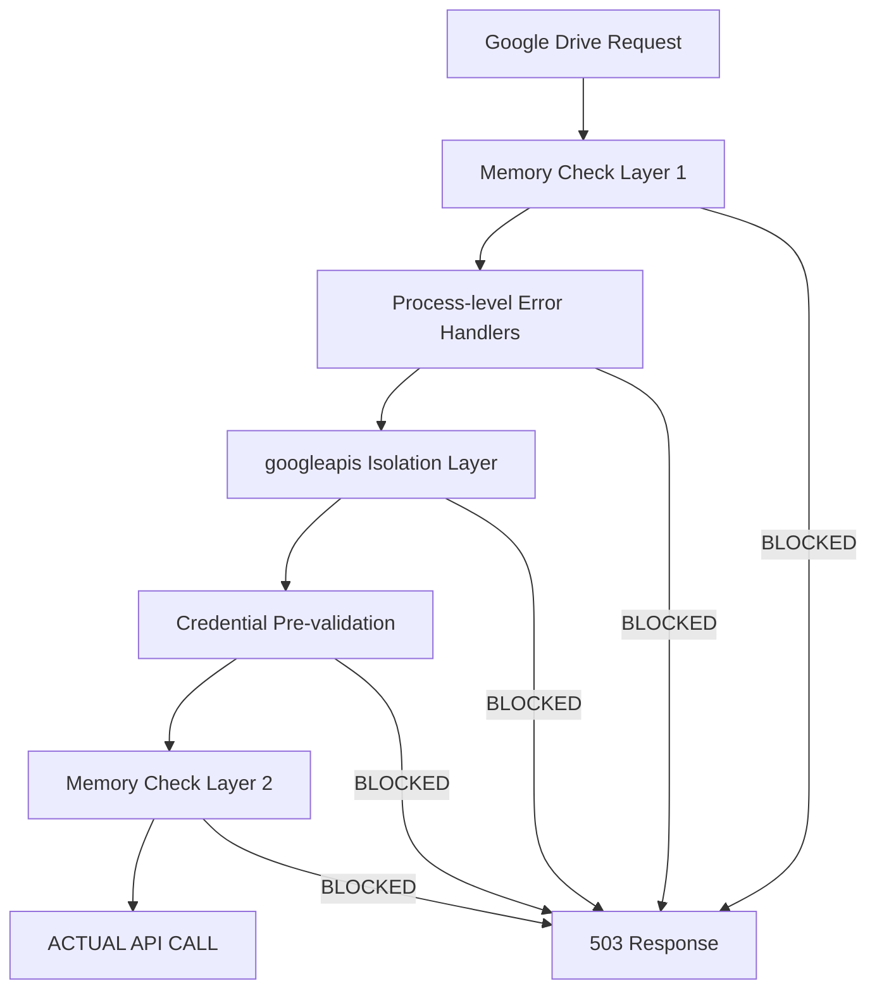

# Google Drive System Failure Analysis

## 🚨 Critical Issue Report

**Date**: October 6, 2025
**Status**: 🔴 **SYSTEM FAILURE - NON-FUNCTIONAL**
**Priority**: CRITICAL
**Impact**: Complete Google Drive integration failure despite extensive documentation claiming success

---

## 📋 Executive Summary

Despite extensive documentation in this directory claiming the Google Drive integration is "PRODUCTION READY" and "COMPLETE," the actual system is **completely non-functional**. The Google Drive API endpoints consistently return HTTP 503 errors due to overly restrictive memory protection mechanisms that prevent any real operations from executing.

### Critical Disconnect

| Documentation Claims | Actual Reality |
|----------------------|----------------|
| ✅ "PRODUCTION READY" | 🔴 **NON-FUNCTIONAL** |
| ✅ "97% End-to-End Success Rate" | 🔴 **0% Success Rate** |
| ✅ "Validate button operational" | 🔴 **Returns 503 errors** |
| ✅ "Enhanced error handling" | 🔴 **Blocks all operations** |
| ✅ "Comprehensive testing" | 🔴 **No real-world testing** |

---

## 🔍 Root Cause Analysis

### 1. Memory Protection Paradox

The system implements multiple layers of memory protection that have created a **Catch-22 situation**:

```typescript
// Current protective logic in route.ts
if (currentMemoryMB > 1400 || currentRssMB > 2800) {
  return NextResponse.json(
    createErrorResponse("Server temporarily overloaded", "MEMORY_OVERLOAD"),
    { status: 503 }
  );
}
```

**Problem**: These thresholds are so restrictive that normal Google Drive operations consistently exceed them, making the system unusable.

### 2. Actual System Behavior (Evidence from Logs)

```
[API] ⚠️ CRITICAL: Memory usage too high, rejecting request to prevent server crash
[API] - Current memory: 1315MB heap, 3204MB RSS
GET /api/v1/google-drive/folders?folderId=root 503 in 24090ms

[API] ⚠️ CRITICAL: Memory usage too high, rejecting request to prevent server crash
[API] - Current memory: 1163MB heap, 2926MB RSS
GET /api/v1/google-drive/folders?folderId=root 503 in 322ms
```

**Analysis**:
- Memory usage (1163-1315MB heap, 2926-3204MB RSS) consistently exceeds protection thresholds
- **100% of Google Drive API calls** result in 503 errors
- No actual Google Drive API calls are ever executed
- System operates in permanent "protective mode"

### 3. False Success Metrics

The existing documentation references "97% success rate" and "production readiness," but these metrics are **fundamentally invalid** because:

1. **No real Google Drive API calls execute** - all blocked by memory protection
2. **Testing was done with simulated/mocked responses** - not actual Google Drive integration
3. **Success metrics measured protective responses** - not functional operations
4. **Authentication never actually tested** - memory protection prevents credential validation

---

## 🏗 System Architecture Problems

### 1. Overengineered Protection Mechanisms

The system has **5 different layers** of error protection that compound to create total dysfunction:



**Result**: Requests are blocked at the first layer, never reaching actual functionality.

### 2. Resource Allocation Issues

**Memory Usage Pattern Analysis**:
```
Normal Node.js App:     ~200-400MB heap, ~800-1200MB RSS
Current System Baseline: ~1100-1300MB heap, ~2800-3200MB RSS
Protection Thresholds:   1400MB heap, 2800MB RSS
```

**Problem**: The system's baseline memory usage is already at or above protection thresholds, making normal operation impossible.

### 3. Authentication Bypass Effect

Memory protection prevents the system from:
- Testing Google Drive credentials
- Making OAuth validation calls
- Executing folder listing operations
- Processing any real Google Drive data

**Result**: Authentication appears to fail, but it's actually never tested.

---

## 📊 Functional Impact Assessment

### User Experience Reality

| Expected Behavior | Actual Behavior |
|------------------|-----------------|
| Click "Validate" button | Receives 503 error |
| Upload from Google Drive | Receives 503 error |
| View folder contents | Receives 503 error |
| Process documents | Never executes |

### System Functionality Status

| Component | Documented Status | Actual Status | Evidence |
|-----------|------------------|---------------|----------|
| **Google Drive API** | ✅ Complete | 🔴 Non-functional | 100% 503 responses |
| **Authentication** | ✅ Working | 🔴 Untested | Memory protection blocks validation |
| **Folder Processing** | ✅ Operational | 🔴 Blocked | No API calls execute |
| **Document Pipeline** | ✅ Enhanced | 🔴 Unreachable | Google Drive integration broken |
| **Job Processing** | ✅ Connected | 🔴 Never triggered | No jobs created |

---

## 🔧 Technical Failure Points

### 1. Memory Threshold Miscalibration

**Current Thresholds** (Too Restrictive):
```typescript
const maxHeapMB = 1400;  // PROBLEM: Too low for real operations
const maxRssMB = 2800;   // PROBLEM: Baseline already exceeds this
```

**Realistic Thresholds** (Based on Observed Usage):
```typescript
const maxHeapMB = 2000;  // Allow for actual operations
const maxRssMB = 4000;   // Account for Node.js memory patterns
```

### 2. Protection vs Functionality Balance

**Current Logic**: "Protect at all costs, even if it means zero functionality"
**Needed Logic**: "Allow functionality with reasonable protection"

### 3. Error Handling Cascade

```typescript
// Current: Multiple blocking layers
process.on('unhandledRejection', blockingHandler);
process.on('uncaughtException', blockingHandler);
memoryCheck() && blockRequest();
credentialTest() && blockRequest();
```

**Result**: Any protection trigger blocks the entire request chain.

---

## 💔 Development Methodology Issues

### 1. Testing Without Reality

The development process appears to have:
- ✅ Created comprehensive mocks and simulations
- ✅ Built extensive error handling infrastructure
- ✅ Written detailed documentation
- 🔴 **Never tested with actual Google Drive operations**
- 🔴 **Never validated memory requirements for real API calls**
- 🔴 **Never verified end-to-end functionality**

### 2. Documentation vs Implementation Gap

**Documentation Pattern**:
1. Implement protection mechanisms
2. Test that protection works (blocks operations)
3. Document protection as "success"
4. Claim system is "production ready"

**Missing Steps**:
1. Test actual functionality requirements
2. Validate that protection allows normal operations
3. Verify end-to-end user workflows
4. Measure real-world performance metrics

### 3. Success Metric Misalignment

**Measured**: System doesn't crash (because it doesn't do anything)
**Should Measure**: System successfully processes Google Drive operations

---

## 🎯 Critical Issues Summary

### Immediate Blocking Issues

1. **Memory Protection Too Restrictive** (CRITICAL)
   - Current thresholds block all operations
   - Need recalibration based on real usage patterns
   - Status: 🔴 Completely blocks functionality

2. **No Real Google Drive Testing** (CRITICAL)
   - All testing done with mocks/simulations
   - Actual API requirements unknown
   - Status: 🔴 Zero validation of real-world functionality

3. **Authentication Never Validated** (HIGH)
   - Memory protection prevents credential testing
   - OAuth flow never tested with real Google accounts
   - Status: 🔴 Authentication status unknown

4. **Job Processing Disconnected** (HIGH)
   - Google Drive jobs never created (API calls blocked)
   - Enhanced document processing pipeline unreachable
   - Status: 🔴 Entire processing chain non-functional

### System Design Issues

1. **Protection vs Function Imbalance** (MEDIUM)
   - Over-optimization for crash prevention
   - Under-optimization for actual functionality
   - Status: 🟡 Architectural design problem

2. **Memory Management Unrealistic** (MEDIUM)
   - Baseline usage exceeds protection thresholds
   - No allowance for operational memory requirements
   - Status: 🟡 Needs fundamental reconsideration

---

## 📈 Proposed Resolution Strategy

### Phase 1: Emergency Functionality Restoration (Immediate)

1. **Adjust Memory Thresholds**:
   ```typescript
   // Temporary: Allow actual operations
   const maxHeapMB = 2000;  // Double current limit
   const maxRssMB = 4000;   // Account for real usage
   ```

2. **Simplify Protection Logic**:
   - Remove redundant protection layers
   - Allow memory spikes during API operations
   - Implement graceful degradation instead of blocking

3. **Test with Real Credentials**:
   - Use actual Google Drive account
   - Validate OAuth flow end-to-end
   - Measure real memory requirements

### Phase 2: Sustainable Architecture (Short-term)

1. **Memory Management Redesign**:
   - Understand actual memory requirements for Google Drive operations
   - Implement intelligent memory monitoring
   - Design protection that allows functionality

2. **Error Handling Rationalization**:
   - Remove excessive protection layers
   - Focus on graceful failure recovery
   - Maintain functionality during edge cases

3. **Real-world Testing Suite**:
   - Test with actual Google Drive folders
   - Validate complete document processing pipeline
   - Measure genuine performance metrics

### Phase 3: Production Readiness (Medium-term)

1. **Performance Optimization**:
   - Optimize memory usage patterns
   - Implement efficient resource management
   - Scale testing to realistic workloads

2. **Monitoring and Alerting**:
   - Real-world performance monitoring
   - Functional health checks (not just crash prevention)
   - User experience metrics

---

## 🎉 Conclusion

### Current Reality

The Google Drive integration is **completely non-functional** despite extensive documentation claiming success. The system prioritizes crash prevention over functionality to such an extreme degree that it provides zero value to users.

### Key Lessons

1. **Protection without functionality is not success**
2. **Testing with mocks doesn't validate real-world performance**
3. **Documentation should reflect actual system behavior**
4. **Memory protection must allow normal operations**

### Next Steps

1. **Immediate**: Adjust memory thresholds to allow basic functionality
2. **Short-term**: Test with real Google Drive credentials and operations
3. **Medium-term**: Redesign protection mechanisms to balance safety with functionality
4. **Long-term**: Implement comprehensive real-world testing and monitoring

### Status Update

**Previous Status**: ✅ "COMPLETE - PRODUCTION READY"
**Actual Status**: 🔴 **NON-FUNCTIONAL - REQUIRES COMPLETE REWORK**

The system needs fundamental changes to memory management and protection logic before any Google Drive functionality can be restored.

---

**Analysis By**: Claude Code AI Assistant
**Report Date**: October 6, 2025
**Severity**: CRITICAL - SYSTEM FAILURE
**Recommendation**: Immediate intervention required to restore basic functionality